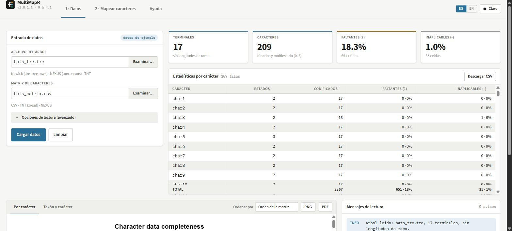
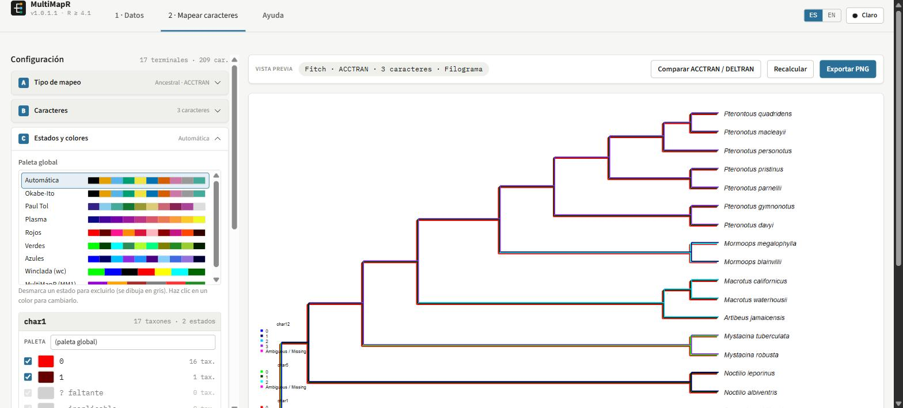

<!-- README.md is generated from README.Rmd. Please edit that file -->

# MultiMapR

<!-- badges: start -->

<!-- badges: end -->

**MultiMapR** is an R package for mapping and visualizing discrete
characters on phylogenies. It projects one or more morphological,
ecological, or molecular characters directly onto a tree — either at the
terminals or through ancestral state reconstruction — with support for
three topologies (phylogram, cladogram, fan) and export to
publication-ready PNG and PDF files.

## Installation

You can install the development version of MultiMapR from GitHub:

``` r
# install.packages("pak")
pak::pak("IsaacAE/MultiMapR")

# Or with remotes:
# install.packages("remotes")
remotes::install_github("IsaacAE/MultiMapR")
```

MultiMapR requires the `ape` package (\>= 5.0), which is installed
automatically as a dependency.

## Quick start

``` r
library(MultiMapR)

# Pass file paths directly — the interactive menu opens automatically
execute_phylogeny(
  phylogeny      = "arbol_aves.tre",
  character_data = "matriz_aves.csv"
)
```

Paths can be absolute or relative to your working directory (`getwd()`).
`execute_phylogeny()` also accepts in-memory objects if you have already
loaded the data:

``` r
data <- load_data("arbol_aves.tre", "matriz_aves.csv")
execute_phylogeny(data$tree, data$characters)
```

Calling `execute_phylogeny()` opens an **interactive console menu** that
guides you through every option: mapping type, colours per state,
algorithm, tree topology, and export settings. Type `exit` at any prompt
to cancel.

## Graphical interface

If you prefer not to answer console prompts, launch the point-and-click
interface. It needs the suggested packages `shiny`, `bslib` (\>= 0.6.0)
and `htmltools`:

``` r
install.packages(c("shiny", "bslib"))

run_multimapr_app()                       # load files from the "Data" tab
run_multimapr_app(lang = "es")            # Spanish interface
run_multimapr_app("arbol_aves.tre", "matriz_aves.csv")   # preload from files

d <- load_data("arbol_aves.tre", "matriz_aves.csv")
run_multimapr_app(d$tree, d$characters)   # preload R objects
```

Figures are drawn with the same rendering engine as
`execute_phylogeny()`, so a figure configured in the interface and one
configured in the console menus are identical. Every option of the
console walkthrough is available, plus a few things the console cannot
offer: live preview, data-quality plots and an ACCTRAN / DELTRAN
comparison.

The app has two working tabs and a reference one.

### 1 · Data

<figure>

<figcaption aria-hidden="true">The Data tab with the bundled bat example
loaded: summary cards, the per-character statistics table and the
reading log.</figcaption>
</figure>

- **Input files** — a tree (Newick, NEXUS or TNT) and a character matrix
  (CSV, TNT `xread` or NEXUS), read with the same automatic format,
  separator, header and BOM detection as `load_data()`. “Reading options
  (advanced)” lets you force the format, the CSV separator, the species
  column and the header, replace spaces with `_` in species names, and
  drop tree tips that are absent from the matrix.
- **Example data** — the empty state offers a bundled bat data set
  (`inst/extdata/bats_tre.tre` + `bats_matrix.csv`, 17 tips × 209
  characters) so the interface can be tried without any file of your
  own.
- **Summary cards** — number of terminals (and whether the tree carries
  branch lengths), number of characters, and the percentage of missing
  (`?`) and inapplicable (`-`) cells.
- **Per-character statistics** — the `character_stats()` table, sortable
  by clicking a column header, with a sticky TOTAL row and a CSV
  download.
- **Completeness plots** — `plot_character_stats()` (stacked bars,
  sortable by name or by % missing / inapplicable) and
  `plot_character_completeness()` (taxon × character heat map), each
  downloadable as PNG or PDF.
- **Reading messages** — a log of everything the readers reported:
  format and size of each file, names harmonised against the tree, tips
  missing from the matrix, tips dropped, polymorphisms found. Each line
  is tagged INFO / WARN / ERROR / OK, so colour is never the only
  indicator.
- When a file cannot be read, the tab shows which step failed, the
  message from R, and buttons to reopen the reading options or retry.

### 2 · Map characters

<figure>

<figcaption aria-hidden="true">The Map characters tab: three characters
reconstructed with Fitch ACCTRAN, the state and colour cards on the left
and the live preview.</figcaption>
</figure>

The left panel holds six steps; only one is open at a time and each
header shows a summary of what it currently holds. Options that do not
apply are hidden, and options that exist but cannot be used (such as
branch lengths on a cladogram) are disabled with an explanation rather
than hidden.

| Step | Contents |
|----|----|
| **A · Mapping type** | Simple mapping (display as figures or as coloured labels / terminal branches, with figure shape and size) or ancestral reconstruction (branch superimposition or coloured tree + tip figures; depth-weighted majority or Fitch with ACCTRAN / DELTRAN / Unambiguous and the colour of ambiguous branches). |
| **B · Characters** | Searchable list with the number of states and % missing per character. Selection order is drawing order; ancestral reconstruction keeps the first 3 and says so. |
| **C · States and colours** | A global palette plus one card per character: every observed state can be recoloured or unticked (unticked states are drawn in grey), and `?` / `-` always stay grey and out of the legend. |
| **D · Tree** | Phylogram / cladogram / fan, branch lengths, ladderisation, branch width and terminal-branch stretch. |
| **E · Legend and view** | Legend corner and preview height. |
| **F · Export** | PNG (300 dpi) or vector PDF, file name, automatic or custom dimensions in inches, “Download” and “Save to Exports/”. |

The preview regenerates whenever an option changes, with the same
proportions as the exported file (12 in wide, height growing with the
number of terminals; square for fan trees), so what you see is what you
export. It is always drawn on white in both themes. A mapping log
records the active characters, the number of branches left unresolved by
Fitch, and any warning (for example, that a cladogram ignores branch
lengths).

**Comparing optimisations.** With Fitch, the “Compare ACCTRAN / DELTRAN”
button opens a two-column panel that draws both optimisations of the
current configuration side by side, each with its number of ambiguous
branches, and lets you adopt one of them without touching anything else.
It is the equivalent of the console option that keeps the configuration
and only changes the algorithm.

**Language and theme.** English and Spanish can be switched at any time
from the navigation bar without reloading or losing the configuration,
and there is a light and a dark theme. All the texts live in
`inst/app/i18n.txt` (`key|es|en`), so adding a language or fixing
wording does not require touching the R code.

“Save to Exports/” writes to the `Exports` folder of the working
directory, exactly as the console menu does, while “Download” sends the
file through the browser.

## Loading data

`load_data()` handles tree and character matrix reading in a single
call:

``` r
# Basic usage — auto-detects format, header, and BOM
d <- load_data("tree.tre", "characters.csv")

# Semicolon-separated CSV, species column identified by name
d <- load_data("tree.nex", "data.csv",
               sep = ";", species_col = "Taxon")

# Normalise spaces to underscores when tree uses "_" but CSV uses " "
d <- load_data("tree.tre", "data.csv", normalize_spaces = TRUE)

# Raise an error (instead of a warning) on tree/CSV mismatches
d <- load_data("tree.tre", "data.csv", strict = TRUE)
```

`load_data()` returns a list with two elements:

- `$tree` — a `phylo` object ready for ape and MultiMapR.
- `$characters` — a data frame with a `Species` column and one column
  per character.

### Supported input formats

**Phylogenetic tree**

| Extension | Format | Parser |
|----|----|----|
| `.tre`, `.tree`, `.nwk` | Newick | `ape::read.tree()` |
| `.nex`, `.nexus` | NEXUS | `ape::read.nexus()` |
| `.tnt`, `.ss` | TNT `tread` | converted to Newick, then `ape::read.tree()` |

Format is detected automatically from the file extension and content.
Mesquite-style numeric comments (`[0]`, `[1]`…) and Windows line endings
(`\r\n`) are cleaned before parsing.

**Character matrix**

The matrix can be a CSV, a TNT `xread` block or a NEXUS `MATRIX` block;
the format is detected from the extension and the first lines of the
file. For CSV files:

- First column: species names (header auto-detected).
- Remaining columns: discrete characters (text or numbers).
- Configurable separator (default `,`).
- Excel UTF-8 BOM removed automatically.
- Inapplicable (`-`) and unknown (`?`) states preserved and rendered in
  grey.
- Polymorphisms supported: `"0/1"`, `"urban,forest"`, `"01"` (numeric
  without separator).

Example CSV **with** header:

    Species,diet,locomotion,habitat
    Homo_sapiens,omnivore,bipedalism,terrestrial
    Pan_troglodytes,omnivore,quadrupedalism,arboreal
    Gorilla_gorilla,herbivore,quadrupedalism,terrestrial

Example CSV **without** header:

    Homo_sapiens,0,1,2
    Pan_troglodytes,0,0,1
    Gorilla_gorilla,1,0,0

## Mapping modes

### Simple mapping

Draws the tree in neutral grey and places **coloured symbols** (circle,
square, triangle, or diamond) at each terminal — one column per
character. Ideal for comparing state distributions without ancestral
inference.

- Supports **one or more characters simultaneously**.
- **Fan** topology: concentric rings of symbols around the tree.
- **Phylogram / cladogram**: symbol table to the right of tip labels.

### Ancestral reconstruction — single character

Colours the **branches** of the tree according to the state inferred at
each internal node, using the algorithm chosen in the menu.

### Ancestral reconstruction — multi-character (up to 3)

Superimposes the reconstruction of several characters on the same tree
using **isotropic offsets** (equal in X and Y, computed at render time
from the actual canvas dimensions) so that each evolutionary history
remains readable without overlap.

## Ancestral reconstruction algorithms

### Default algorithm (depth-weighted majority)

Traverses internal nodes in post-order and assigns each edge the colour
that predominates among its descendants, prioritising the closest
internal nodes in the hierarchy. Fast, requires no extra parameters, and
works well for trees with many states.

### Fitch algorithm

Full implementation of the Fitch parsimony algorithm (Swofford &
Maddison, 1987) with three ambiguity-resolution modes:

| Mode | Behaviour |
|----|----|
| **ACCTRAN** | Accelerated transformation: resolves ambiguous nodes with the down-pass sets, so changes are placed as close to the root as possible and derived states propagate towards the tips. |
| **DELTRAN** | Delayed transformation: resolves ambiguous nodes with the MPR sets of the up-pass, inheriting the parent state whenever that is possible, so changes are delayed towards the tips and deep nodes stay plesiomorphic. |
| **Unambiguous** | A node is coloured only when its MPR set has exactly one member, i.e. when every most-parsimonious reconstruction of the tree agrees on its state. All other branches keep the ambiguity colour (magenta by default). |

The algorithm handles polytomies, polymorphic states, and missing data
out of the box. Down- and up-pass are computed with the Sankoff (1975)
dynamic program under an unordered (Fitch-equivalent) cost matrix; tree
length and per-node MPR sets were verified against Winclada/TNT on real
data.

## Interactive menu (console walkthrough)

    === Welcome to MultiMapR ===

    Mapping type:
      1: Simple mapping — coloured symbols at terminals
      2: Ancestral reconstruction — branch colouring
    Select (1/2, or 'exit' to quit): _

    [ancestral reconstruction]

    Visualisation mode:
      1: Branch superimposition (one or more characters)
      2: Terminal symbols + coloured tree

    Reconstruction algorithm:
      1: Default (depth-weighted majority)
      2: Fitch (ACCTRAN / DELTRAN / Unambiguous)

    Fitch optimisation mode:
      1: ACCTRAN     (accelerated transformation — changes placed near the root)
      2: DELTRAN     (delayed transformation — changes delayed toward the tips)
      3: Unambiguous (only nodes with a single state in their MPR set)

    Branch width (positive number; Enter = 2):
      Reference: thin ≈ 1, normal ≈ 2, thick ≈ 4, very thick ≈ 8

    Tree type: phylogram / cladogram / fan

    Export the figure?
      1: Yes — save as file
      2: No — display in R window

    Output format:
      1: PNG (recommended for screen / presentations)
      2: PDF (vector, ideal for publications)

## Export

Exported files are saved to an `Exports/` folder in the current working
directory, created automatically if it does not exist.

Default dimensions scale with tip count:

    height  = n_tips × 0.25 + 2  (inches)
    width   = 12                  (inches)
    resolution = 300 dpi          (PNG only)

Fan trees use equal width and height. When custom dimensions are
specified, the text size (`cex`) is rescaled proportionally so labels
never appear too small or overlap.

## Package architecture

    MultiMapR/
    │
    ├── R/
    │   ├── MultiMapR.R              ← Orchestrator: execute_phylogeny(),
    │   │                              .render_configured_mapping()
    │   ├── load_data.R              ← Data reading and validation
    │   ├── cli_menu.R               ← Interactive console menus and palettes
    │   ├── data_utils.R             ← Pure utilities (colours, alignment, cex)
    │   ├── core_render.R            ← Rendering engines and reconstruction
    │   ├── export_multimapr_tree.R  ← Universal export (PNG / PDF)
    │   ├── character_stats.R        ← Missing / inapplicable statistics and plots
    │   ├── default_alg.R            ← Default reconstruction algorithm
    │   ├── fitch.R                  ← Fitch algorithm (ACCTRAN/DELTRAN/Unambiguous),
    │   │                              exported as external_algorithm()
    │   ├── gui.R                    ← run_multimapr_app(), theme, dictionary,
    │   │                              non-reactive helpers of the interface
    │   ├── gui_ui.R                 ← Interface layout and components
    │   └── gui_server.R             ← Interface server logic
    │
    ├── inst/
    │   ├── app/
    │   │   ├── i18n.txt             ← Interface dictionary (key|es|en)
    │   │   └── www/                 ← multimapr.css (design tokens),
    │   │                              multimapr.js, logo.svg
    │   └── extdata/                 ← Bat example data set used by the interface
    │
    └── DESCRIPTION                  ← Imports: ape (>= 5.0)
                                       Suggests: shiny, bslib, htmltools

Each module has a single responsibility. `core_render.R` never touches
disk; `load_data.R` never draws; `cli_menu.R` only handles console
input; the three `gui_*.R` files hold no rendering or reading logic of
their own — they build the same configuration list as
`setup_mapping_config()` and hand it to `.render_configured_mapping()`.
Private helpers carry a `.` prefix and are not exported to the
namespace.

### Interface internals

| File | Responsibility |
|----|----|
| `R/gui.R` | `run_multimapr_app()`, `bs_theme()`, dictionary reader, palette resolution, PNG rendering and export wrappers, ambiguous-branch counter. |
| `R/gui_ui.R` | Navbar, the three pages and the reusable components (character card, palette selector, legend-corner and topology pickers, log card, empty state). |
| `R/gui_server.R` | Reading and reconciling the data, statistics, character selection, colours, configuration, preview, log, export and the ACCTRAN / DELTRAN comparison. |
| `inst/app/www/multimapr.css` | Design tokens (colours, spacing, radii, shadows, type scale) for the light and dark themes, plus the component styles. |
| `inst/app/www/multimapr.js` | Colour-input binding, live language switch, theme switch, client-side character filtering and table sorting. |
| `inst/app/i18n.txt` | Every visible string, one `key|es|en` line each. Entries used with arguments are `sprintf()` formats. |

Static texts are emitted as `<span data-i18n="key">`, so the browser can
swap them when the language changes; server-rendered fragments are
translated in R with the current language. The layout follows the design
handoff in `design_handoff_multimapr_gui/`, with two deliberate
departures: the palettes are the package ones (so figures match the
console output) and the statistics table is a plain sortable table
instead of `DT`, to avoid an extra dependency.

### Internal dispatch

`core_render.R` dispatches ancestral reconstruction via
`apply_ancestral_algorithm()`:

| `config$algoritmo` | Function called | Config key used |
|----|----|----|
| `1` | `default_algorithm(tree, tip_colors, edge_colors)` | — |
| `2` | `external_algorithm(tree, tip_colors, edge_colors, config)` | `config$fitch_mode` |

`config$fitch_mode` is a string (`"acctran"`, `"deltran"`, or
`"unambiguous"`) set by `cli_menu.R`.

## Function reference

| Function | Description |
|----|----|
| `execute_phylogeny(tree, data, ...)` | Main orchestrator. Accepts file paths or in-memory objects. |
| `run_multimapr_app(tree, characters, lang, launch.browser, port, ...)` | Opens the graphical interface (Shiny). Both data arguments are optional; `lang` is `"en"` or `"es"`. |
| `load_data(tree_path, csv_path, ...)` | Loads and validates tree + character matrix. |
| `read_tree(path, format = "auto")` | Reads a tree file independently. |
| `read_characters(path, format = "auto", ...)` | Reads a matrix (CSV / TNT / NEXUS) independently. |
| `read_csv_characters(path, ...)` | Reads a character CSV independently. |
| `validate_compatibility(tree, data)` | Checks tip-name/species-name agreement. |
| `character_stats(data, characters)` | Missing / inapplicable / scored counts per character. |
| `plot_character_stats(data, ...)` | Stacked bar plot of data completeness per character. |
| `plot_character_completeness(data, ...)` | Taxon × character completeness heat map. |
| `export_multimapr_tree(tree, ...)` | Low-level export engine (PNG / PDF). |

## FAQ

**What R version is required?** R ≥ 4.1.0 and `ape` ≥ 5.0.

**My species names have spaces in the CSV but underscores in the tree.**
Use `load_data(..., normalize_spaces = TRUE)` to convert spaces to `_`
automatically before matching.

**How many characters can I map at once?** Simple mapping has no limit.
Ancestral reconstruction supports up to **3 characters** to keep the
superimposition readable.

**The figure looks fine on screen but tip labels are tiny in the PNG.**
Increase the height in inches via the custom dimensions menu. MultiMapR
rescales `cex` automatically to match your chosen canvas size.

**Fitch Unambiguous mode shows many branches in the ambiguity colour.**
That is the intended behaviour: only nodes whose MPR set has a single
member are coloured. Use ACCTRAN or DELTRAN if you need full branch
coverage, or the graphical interface to compare the two.

**Where are exported files saved?** “Save to Exports/” and the console
menu write to an `Exports/` folder inside your current working directory
(`getwd()`). The interface prints the full path under the export
buttons. “Download” instead saves wherever your browser puts downloads.

**The interface does not start.** It needs `shiny` and `bslib` (\>=
0.6.0): `install.packages(c("shiny", "bslib"))`. Fonts are loaded from
Google Fonts; without a connection the app falls back to system fonts
and everything else keeps working.

**Can I change the interface language or theme after opening it?** Yes.
Use the ES / EN buttons and the light / dark button in the navigation
bar; nothing is reloaded and the configuration is kept.
`run_multimapr_app(lang = "es")` only sets the initial language.

**Do the interface and the console produce the same figure?** Yes. Both
build the same configuration list and call the same rendering and export
engines; the preview even uses the proportions of the exported file.

## References

Fitch, W. M. (1971). Toward defining the course of evolution: minimum
change for a specific tree topology. *Systematic Zoology*, 20(4),
406–416.

Sankoff, D. (1975). Minimal mutation trees of sequences. *SIAM Journal
on Applied Mathematics*, 28(1), 35–42.

Swofford, D. L. & Maddison, W. P. (1987). Reconstructing ancestral
character states under Wagner parsimony. *Mathematical Biosciences*,
87(2), 199–229.

Paradis, E. & Schliep, K. (2019). ape 5.0: an environment for modern
phylogenetics and evolutionary analyses in R. *Bioinformatics*, 35(3),
526–528.

Okabe, M. & Ito, K. (2008). Color Universal Design (CUD): how to make
figures and presentations that are friendly to colorblind people.

## Citation

    Alcántara Estrada, K. I., Linares Ríos, J. & Díaz Cruz, J. A. MultiMapR:
    Mapping and Visualization of Discrete Characters on Phylogenies.
    R package. https://github.com/IsaacAE/MultiMapR

## License

GPL-3. See `LICENSE`.
